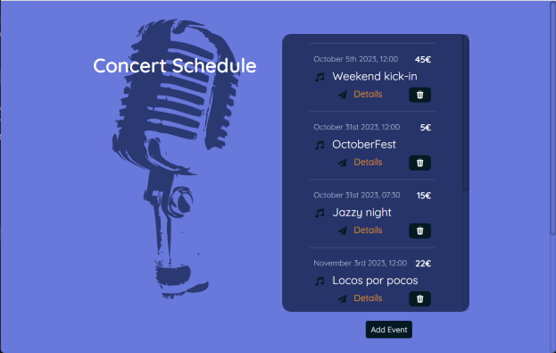
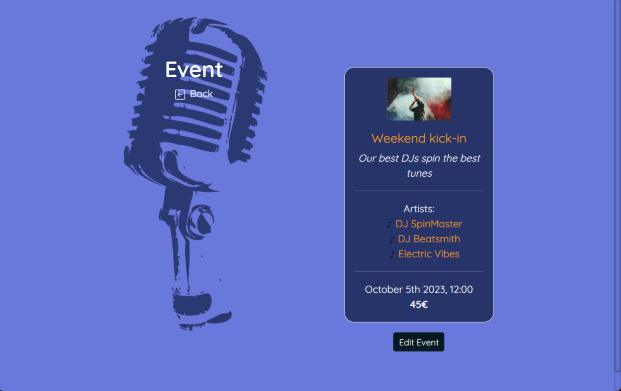
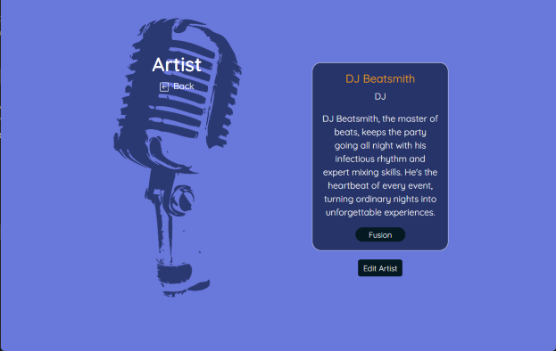
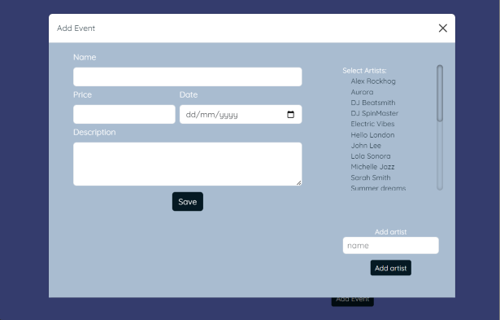
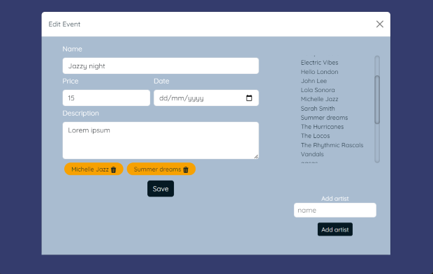
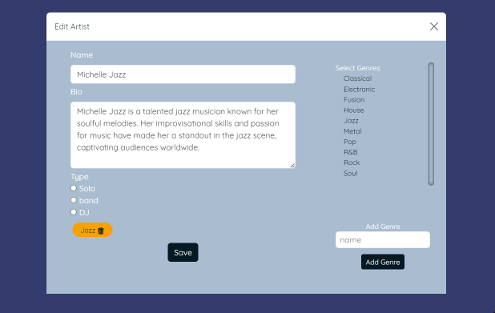

# GraphQL Event App

## Description

This is a front-end for a simple concert administration app built in order to investigate the use of  GraphQL and Apollo client.

The app lists upcoming concerts, shows details of each concert and details of artists. 

The administrator can add, edit and delete concerts, and add and edit artists.

The backend for the app can be found here: 
- [@vitejs/plugin-react](https://github.com/)

## Tech

- React - Vite
- GraphQL
- Apollo client
- Bootstrap
- Sass 
- Moment

## Preview

